<!--
Hidden Prodigy Paradox • README
Style: bold, cosmic, readable. GitHub-safe animations via GIFs/SVG.
-->

<p align="center">
  
</p>

<h1 align="center">Hidden Prodigy Paradox <br/> <sub>Strength in Disguise • Field Guide</sub></h1>

<p align="center">
  <a href="#-mission">Mission</a> ·
  <a href="#-live-demo">Live Demo</a> ·
  <a href="#-original-passage-verbatim">Verbatim</a> ·
  <a href="#-expanded-field-guide">Expanded</a> ·
  <a href="#-use-it-offline">Offline</a> ·
  <a href="#-teach--remix">Teach</a> ·
  <a href="#-license">License</a>
</p>

<p align="center">
  
  
  
  
</p>

---

## 🌱 Mission

> **Prenarrative inversion**: what looks small, fragile, or marginal is often incubating exponential strength.  
> **Extrasuperficial reframing**: beneath contradictions lies deeper harmony—mycelial networks, not pyramids.

This repo packages the **Hidden Prodigy Paradox** as:

- A polished, **single-file offline app** (`index.html`) with **IndexedDB** notes/highlights.
- An **epic README** (this doc) that teaches, illustrates, and invites contribution.

**Operating system upgrade:** extraction, secrecy, and delay are obsolete. Peace, transparency, and regenerative tokenomics are the compounding default. ♻️

---

## 🚀 Live Demo

- `index.html` (offline-first):  
  - Double-click to open, or serve locally:
    ```bash
    python3 -m http.server 7700
    # open http://localhost:7700/index.html
    ```

> The app includes a hero animation, interactive cards, highlights, favorites, and notes saved to **IndexedDB**—no servers, no tracking.

---

## 🎨 Visual Language

- **Cosmic gradient** UI with subtle starfield (use `media/banner_starfield.gif`).
- **Neon accent palette**: mint (#72e6b9), periwinkle (#9aa7ff), solar amber (#ffd479).
- **Iconic motifs**: seed → tree, chrysalis → butterfly, mycelial mesh, gravity well.

<p align="center">
  
</p>

> Want motion? Add short looping **GIFs** in `media/` (GitHub renders GIFs reliably).

---

## 🧭 Original Passage (Verbatim)

> _Preserved exactly as authored—immutable context for the expansion below._

<details>
<summary><strong>Show Verbatim</strong></summary>

What you’ve just described is a very old, very alive pattern: strength disguised as weakness, prodigy hidden in plain sight. Nature and culture both play this game constantly. Let’s dig into some examples that make the paradox sing.  

---

### In Nature
- **Seed vs. Tree**  
  A seed is tiny, fragile, looks like it could be crushed underfoot. Yet packed inside is the entire architecture of a massive oak or sequoia. Its weakness is camouflage until it “switches on” its cycle of exponential growth.  

- **Caterpillar vs. Butterfly**  
  The caterpillar is slow, vulnerable, an easy snack for birds. Yet within its so-called “weak” body is the imaginal disk—the genetic blueprint for transformation into a butterfly. Its very fragility is the cocoon for future strength.  

- **Octopus Larvae**  
  Newly hatched octopi are minuscule and transparent, drifting plankton. They look like they have no defenses at all, yet hidden within are some of the most sophisticated nervous systems on Earth, future escape artists capable of feats rivaling human-level problem solving.  

- **Mycelium**  
  Fungal threads look like dust, weakness itself, but beneath the soil they weave networks more powerful than any centralized server farm—routing nutrients, signaling danger, and sustaining entire forests.  

---

### In Physics & Phenomena
- **Quantum Tunneling**  
  A single particle seems powerless against a barrier. Yet through quantum effects, it “slips” through walls that should be impenetrable. Weakness—its tiny mass and energy—becomes the trick that allows the impossible.  

- **Critical Mass**  
  One neutron looks trivial, insignificant. Yet at the right moment it cascades into a chain reaction, unleashing vast stored energy. Weakness of the unit, strength of the system.  

- **Gravity**  
  Of the fundamental forces, gravity is the weakest by orders of magnitude. But it organizes galaxies, sculpts stars, and governs the architecture of the universe.  

---

### In Human and Cultural Cycles
- **Exiled Figures**  
  History is littered with people underestimated, ignored, or cast out—who later became culture-shapers. Socrates was mocked as barefoot and poor, yet his “weak” position freed him from power games to seed Western philosophy.  

- **Hidden Children**  
  Stories from Moses to Harry Potter repeat the archetype of the vulnerable infant hidden away, precisely because their future influence is immense. The cloak of weakness is protective camouflage until strength is ready.  

- **Neurodivergence**  
  Many prodigies—scientific, artistic, spiritual—show up as “out of step” with their society. What looks like fragility, eccentricity, or incapacity can be the hidden doorway into radical new insight.  

---

So yes—the paradox you’re pointing to is woven into the very operating system of existence. Weakness is often the mask evolution uses to incubate prodigies, whether seeds, children, forces, or ideas. The cloak works because predators, rivals, or critics dismiss what doesn’t appear threatening.  

That’s the deeper cycle: systems underestimate what looks small, fragile, or marginal, and that underestimation buys the hidden prodigy enough time to grow into unstoppable strength.  

This suggests a larger inversion: in every “weak link” around us might be a future center of gravity. The game is learning to notice the camouflaged seeds before they tower over the canopy.
</details>

---

## 🧬 Expanded Field Guide

> Pattern → Signals → Actions. Designed for **peace-by-default** systems.

### Mythic Map
- **Trickster** (Anansi/Loki): feigned folly to outmaneuver giants.  
- **Hidden Heir** (Moses/Sundiata/Arthur): risk → concealment → return.  
- **Pilgrim-Scientist** (Socrates/Hypatia): social “weakness” as intellectual sovereignty.  
- **The Seed** (Demeter/Persephone): descent as precondition for bloom.  

### Detection Heuristics
- High-variance output, low institutional fit.  
- Asymmetric curiosity: deep mastery + playful breadth.  
- Chronic underestimation by status-seekers.  
- Stewardship tells: protects commons, shares credit, builds soil.

### Physics Echoes
- **Gravity** (weakest force) shapes galaxies.  
- **Quantum tunneling** defeats walls via smallness.  
- **Phase transitions**: invisible thresholds flip the world.

### Biology Echoes
- Seed → **exponential growth**.  
- Chrysalis → **imaginal cells**.  
- **Mycelium** → quiet power, networked resilience.

### Cultural Echoes
- Margins today → **center of gravity** tomorrow.  
- Neurodivergent patterns → new frames, new tools.

### Action Prompts
- Fund **small experiments** with large option value.  
- Build **weak-signal shelters** (labs, grants, quiet time).  
- Reward **auditable public-good outputs**, not status displays.  
- **Archive early**, protect sovereignty, make enough public to be verifiable.

<p align="center">
  
</p>

---

## 💾 Use It Offline

- **Run the app:** open `index.html` directly (or via a local server).
- **Your data stays local:** highlights, favorites, and notes are stored in **IndexedDB**.
- **Export:** click **Export Notes JSON** to download your curation.
- **Print/PDF:** click **Print** for a clean, typographic handout.

> The inline Service Worker caches the page for offline use after first load.

---

## 🧑‍🏫 Teach & Remix

<details>
<summary><strong>Facilitator Mode</strong></summary>

- Start with the **verbatim block** (immutable context).
- Use the **cards** (Mythic/Physics/Biology/Culture/Actions) as stations.
- Invite learners to **highlight** lines and **export** notes.
- Close with **prenarrative inversion**: name three “weak signals” around you that could be tomorrow’s centers of gravity—and design a shelter for each.
</details>

<details>
<summary><strong>Design Language</strong></summary>

- **Palette:** #0b0f14 background, accents #72e6b9 / #9aa7ff / #ffd479.  
- **Typography:** bold display for headings, comfortable body text.  
- **Motion:** subtle starfield banner GIFs and diagram GIFs, lightweight only.  
- **Assets:** place images in `media/` and reference them relatively.
</details>

---

## 🗂 Repo Layout

